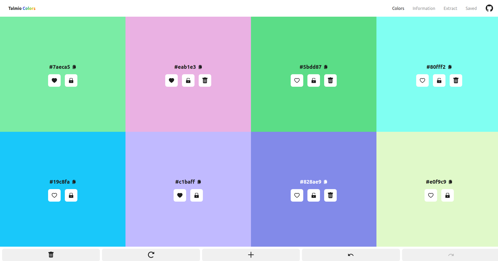
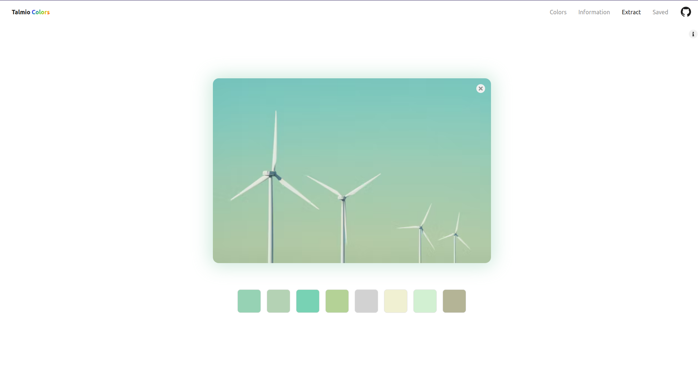

# Colors


A web-application to generate colors, extract colors from images and more. Try out the application at [colors.marcusfredriksson.com](https://colors.marcusfredriksson.com).

## Introduction

Dealing with colors can be a challenge without the right tools. `Colors` was created as a solution to this problem. Offering valueable tools to help you with color management, it's a great tool to use in your projects. The project was created out of personal requirements and convenience.

### Color Generator

Generate random colors and save them for later. Use the spacebar for quickly regenerate the colors, and the arrow keys to undo and redo the regeneration.



### Shades and Alternate Colors

See if a color is what you're looking for and see all the related colors, including shades, values and alternate colors.


### Color Extractor

Quickly generate a color palette- or choose individual colors from an image.

_Note: Images are processed client side and are never uploaded anywhere_



## Progressive Web app (PWA)

The application is PWA compatible and thus downloadable for offline usage. If you want to have it quickly accessible, bookmark it on Safari or install it with your browsers respective installer.

_Service workers are disabled in development_

## Development

If you want to contribute to the project, please feel free to do so. You can get started by cloning the repository and running the following command (assuming you have a git client installed):

```bash
git clone https://github.com/marcusfrdk/colors.marcusfredriksson.com colors
cd colors
npm install
```

When everything is installed, start the development server with the following command:

```bash
npm run dev
```
