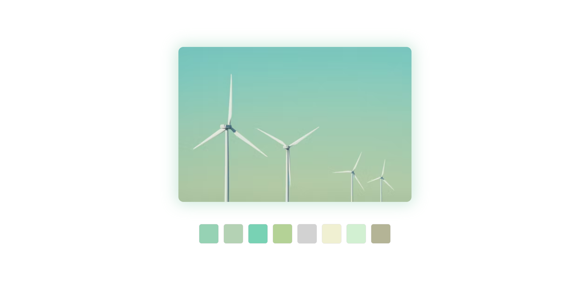

# Colors


A web-application to generate colors, extract colors from images and more. Try out the application at [colors.marcusfredriksson.com](https://colors.marcusfredriksson.com).

## Usage

### Color Generator

This is the page where you can generate a color palette. At the bottom of the page, you will find the toolbar.


The toolbar is the main way of interacting with the application. To the left, you will find a trash can, this will reset any changes and history you have made.

To the right of the trash can, you can see the refresh button, this will refresh all **unlocked** colors. _You can lock/unlock a color by pressing the lock icon on a color._

In the center you can see a plus icon, this will add a color (max 12). _This can also be triggered by pressing the **spacebar** on your keyboard._

To the right of the plus you will find an arrow to the left and the right. This will navigate through the history (undo/redo). _These can be triggered by pressing the **arrow left** and **arrow right** buttons on your keyboard respectively._

Pressing the heart icon will save the color and pressing the color itself will take you to the information page.

## Information

The information page will give an in-depth view of a specific color. You will find information such as the various color type values, a gradient with the color and some of the gradient colors. You will also find many of the different common color schemes. At the bottom you will find a "clear history" button to clear localstorage.

## Extract

_Note: **No images are ever uploaded**. They are only parsed locally on your machine._

The extract page allows you to parse an image and generate a color palette based of the image. Images can either be dragged-and-dropped anywhere on the page or parsed by pressing the "Select image" button to select the image.

At the bottom of the page (before parsing), you can select the number of colors to show once finished.

## Saved

The saved page is a list of all colors you have saved.

## Development

If you want to contribute to the project, please feel free to do so. You can get started by cloning the repository and running the following command (assuming you have a git client installed):

```bash
git clone https://github.com/marcusfrdk/colors.marcusfredriksson.com colors
cd colors
npm install
npm run dev
```
